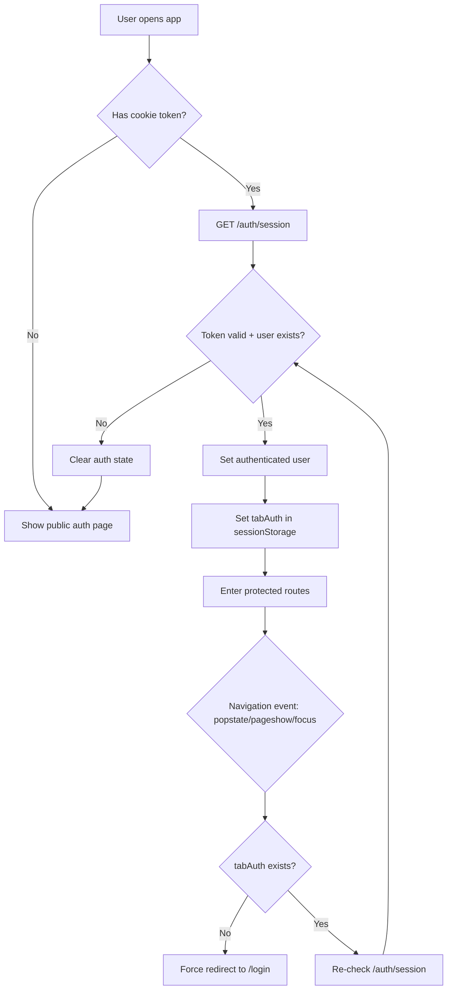
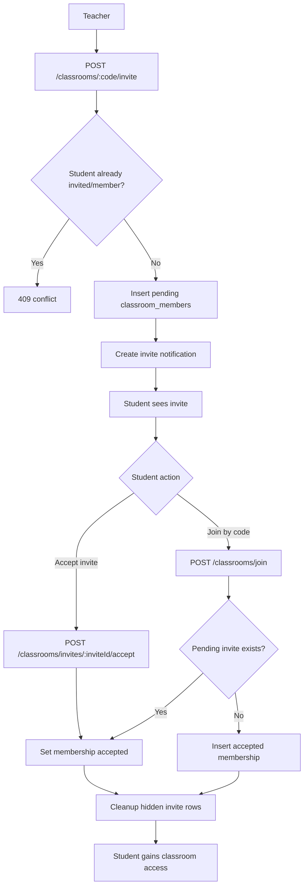
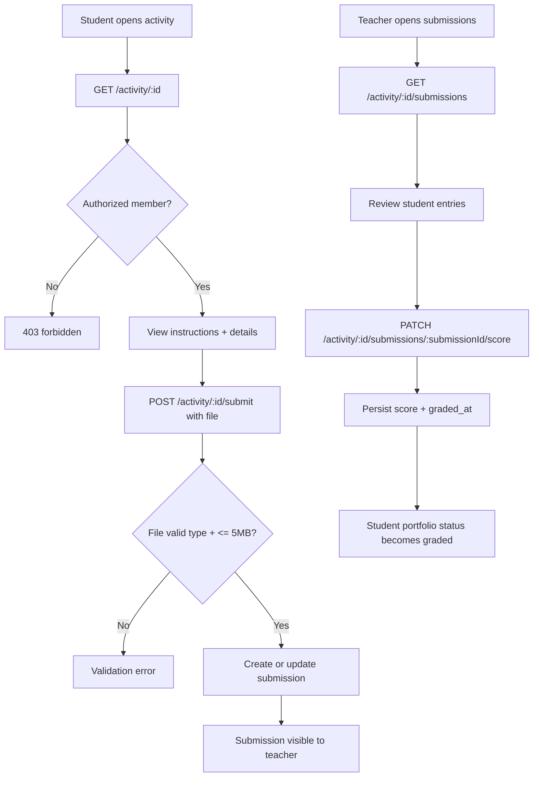
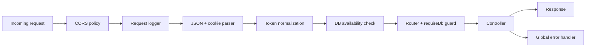

# Digital Portfolio Flowcharts

This file contains Mermaid diagrams for the most important backend and app flows.

## 1. Authentication and session restore

## 2. Classroom invite and join flow

## 3. Activity submission and grading flow

## 4. Backend HTTP pipeline

