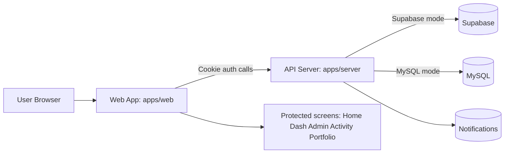
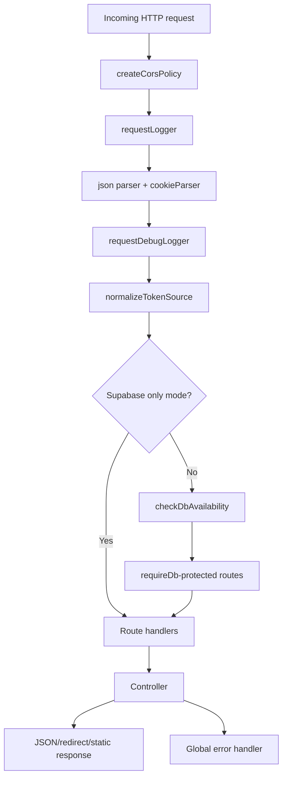
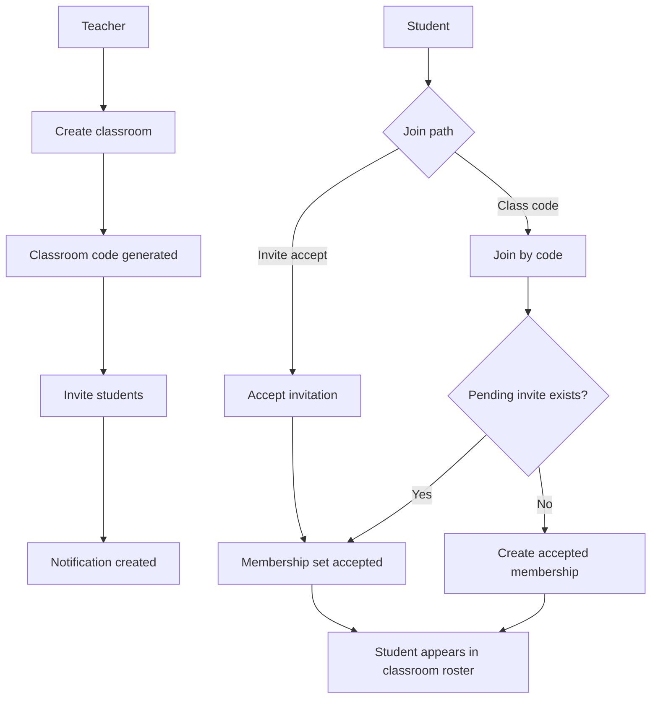
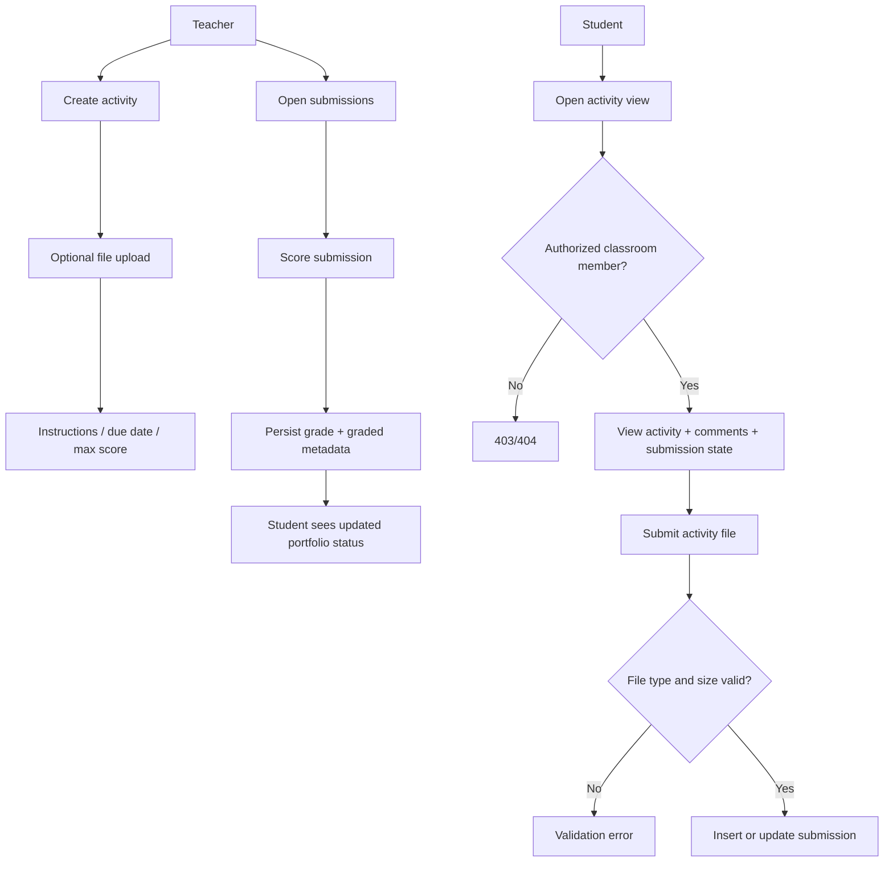
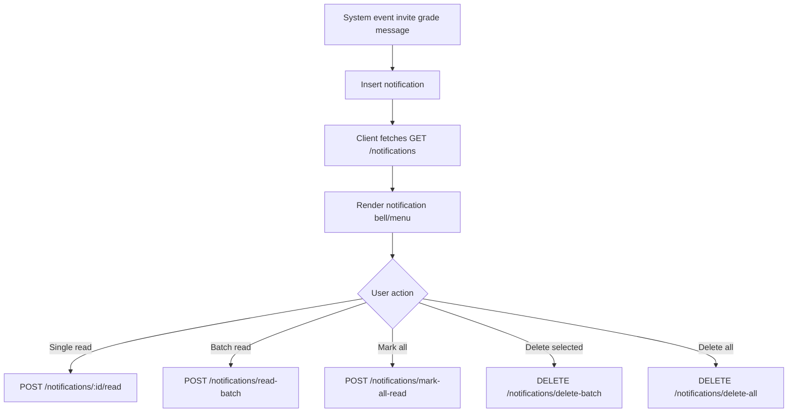
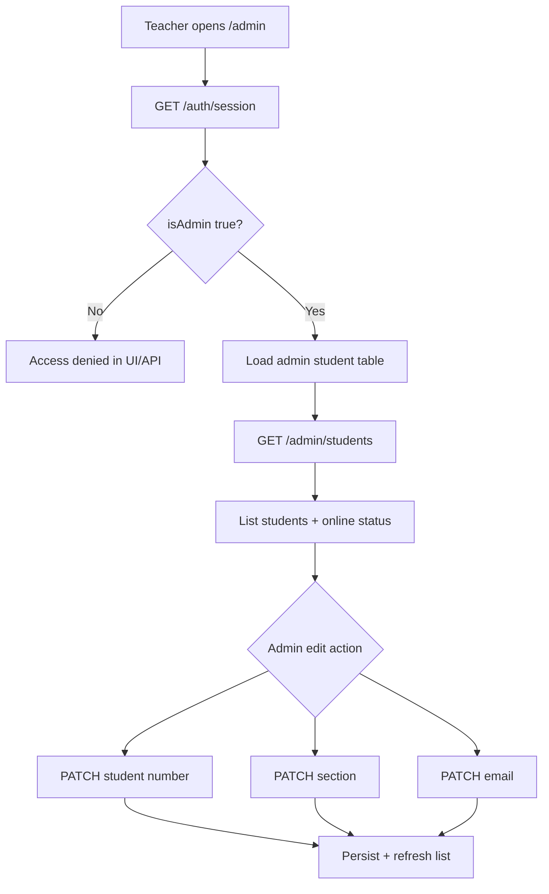
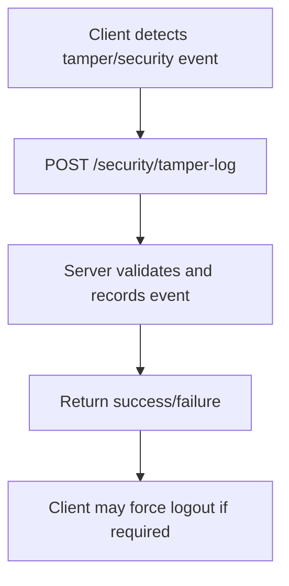

# Digital Portfolio Flowcharts

This file documents end-to-end system flows for the current monorepo (`apps/web` + `apps/server`).

## 1. High-level system flow



## 2. Web route + protected route flow

```mermaid
flowchart TD
  A[Open route in web app] --> B{Public route?}
  B -- Yes --> C[Render Login Signup Forgot RoleSelect]
  B -- No --> D[ProtectedRoute calls GET /auth/session]

  D --> E{Session success?}
  E -- No --> F[Show Unauthorized message]
  F --> G[Redirect to /login]
  E -- Yes --> H[Render protected screen]

  H --> I{Route target}
  I --> J[/home or /dash]
  I --> K[/admin]
  I --> L[/join or /create]
  I --> M[/activity/:id/view]
  I --> N[/portfolio]
```

## 3. Authentication lifecycle

```mermaid
flowchart TD
  A[User submits login signup verify reset] --> B[/auth endpoints]
  B --> C[Controller validates payload]
  C --> D{Valid credentials / code?}
  D -- No --> E[Error response]
  D -- Yes --> F[Generate JWT]
  F --> G[Set httpOnly auth cookie]
  G --> H[Client stores minimal user state]
  H --> I[Subsequent GET /auth/session checks]
  I --> J{Cookie still valid?}
  J -- Yes --> K[Keep authenticated]
  J -- No --> L[Clear local auth + force login]
```

## 4. Server request pipeline



## 5. Classroom lifecycle



## 6. Activity lifecycle (teacher + student)



## 7. Notifications flow



## 8. Admin management flow



## 9. Security/tamper reporting flow


