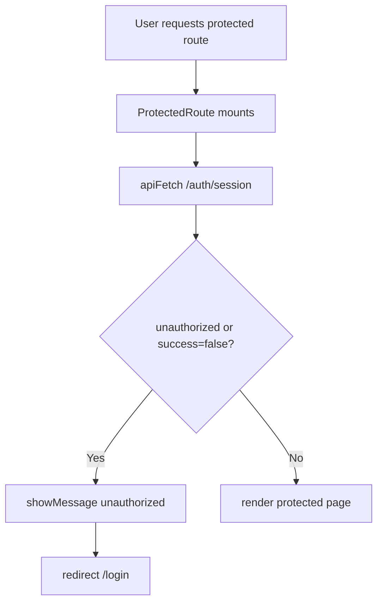
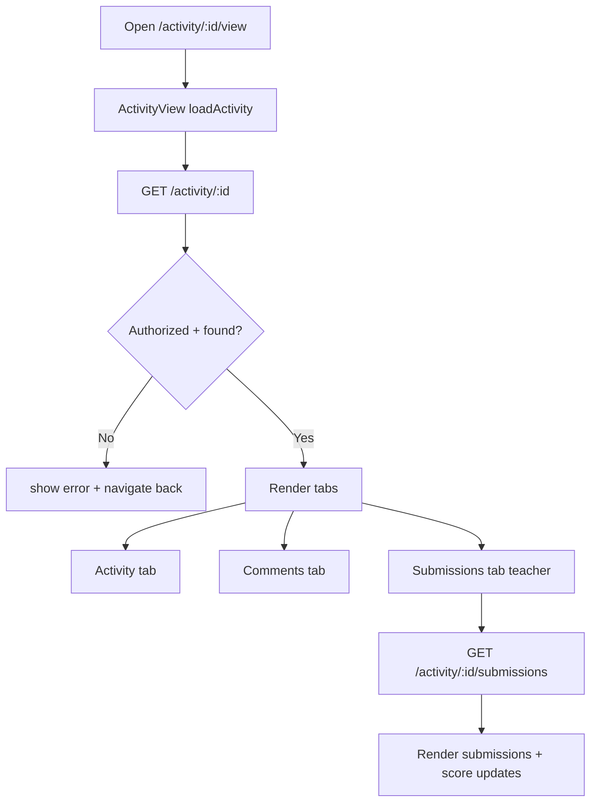
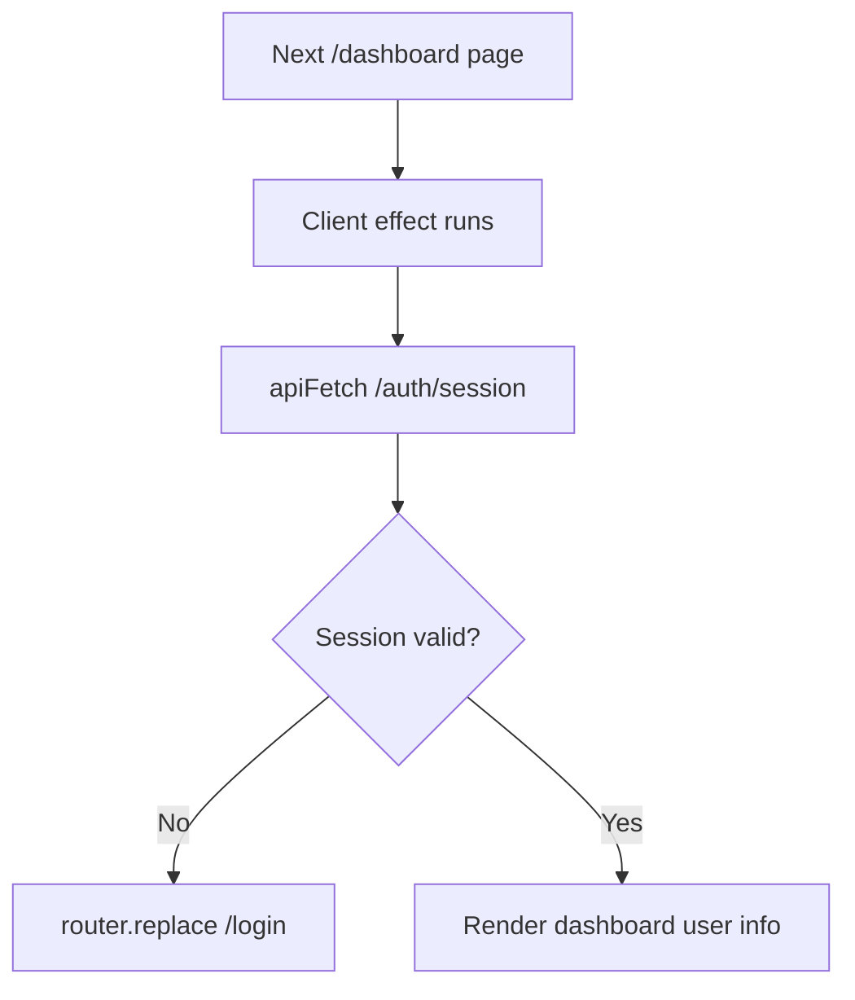
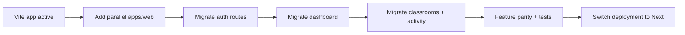

# Frontend Flowcharts

## 1. Current Vite auth guard flow

```mermaid
flowchart TD
  A[User requests protected route] --> B[ProtectedRoute mounts]
  B --> C[apiFetch /auth/session]
  C --> D{unauthorized or success=false?}
  D -- Yes --> E[showMessage unauthorized]
  E --> F[redirect /login]
  D -- No --> G[render protected page]
```

## 2. Activity page load and interaction flow

```mermaid
flowchart TD
  A[Open /activity/:id/view] --> B[ActivityView loadActivity]
  B --> C[GET /activity/:id]
  C --> D{Authorized + found?}
  D -- No --> E[show error + navigate back]
  D -- Yes --> F[Render tabs]

  F --> G[Activity tab]
  F --> H[Comments tab]
  F --> I[Submissions tab teacher]

  I --> J[GET /activity/:id/submissions]
  J --> K[Render submissions + score updates]
```

## 3. Next.js migration auth flow

```mermaid
flowchart TD
  A[Next /dashboard page] --> B[Client effect runs]
  B --> C[apiFetch /auth/session]
  C --> D{Session valid?}
  D -- No --> E[router.replace /login]
  D -- Yes --> F[Render dashboard user info]
```

## 4. Incremental migration strategy

```mermaid
flowchart LR
  A[Vite app active] --> B[Add parallel apps/web]
  B --> C[Migrate auth routes]
  C --> D[Migrate dashboard]
  D --> E[Migrate classrooms + activity]
  E --> F[Feature parity + tests]
  F --> G[Switch deployment to Next]
```
